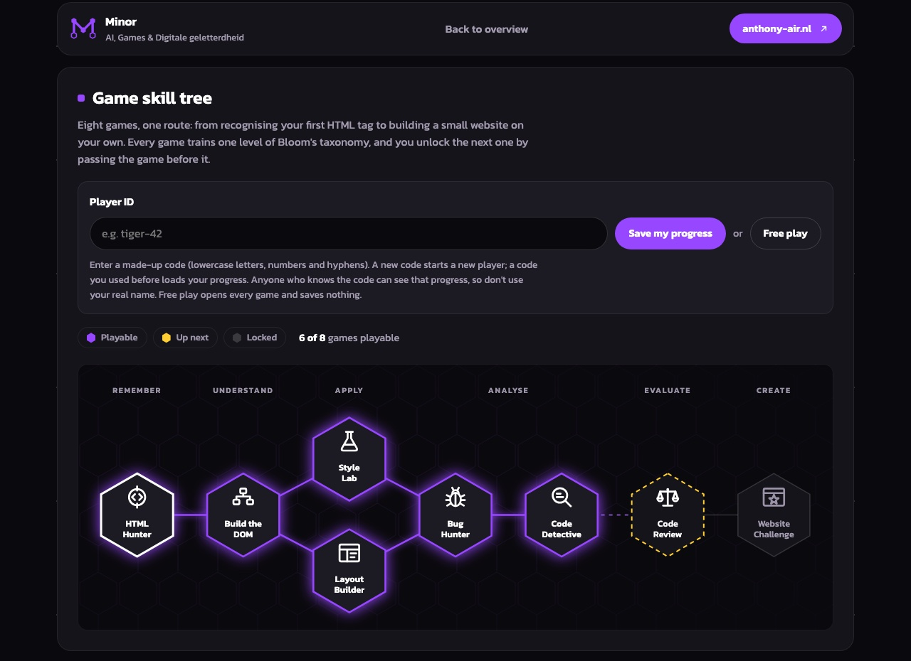
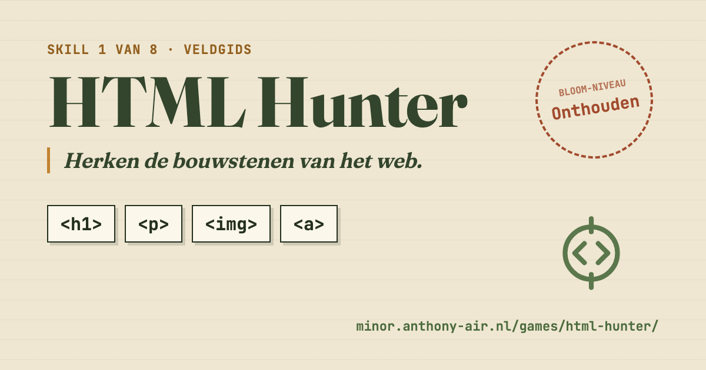
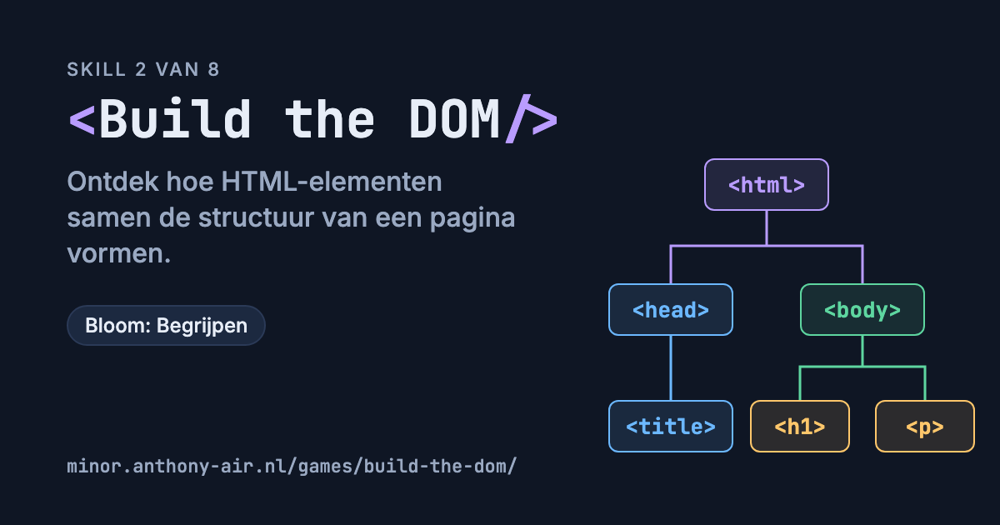
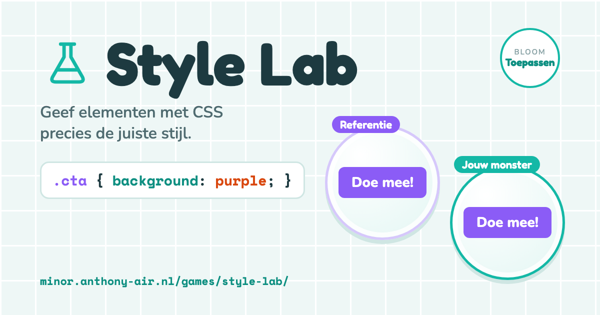
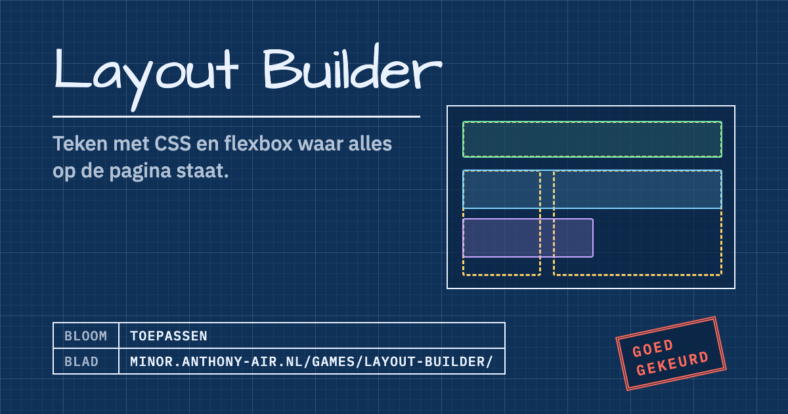
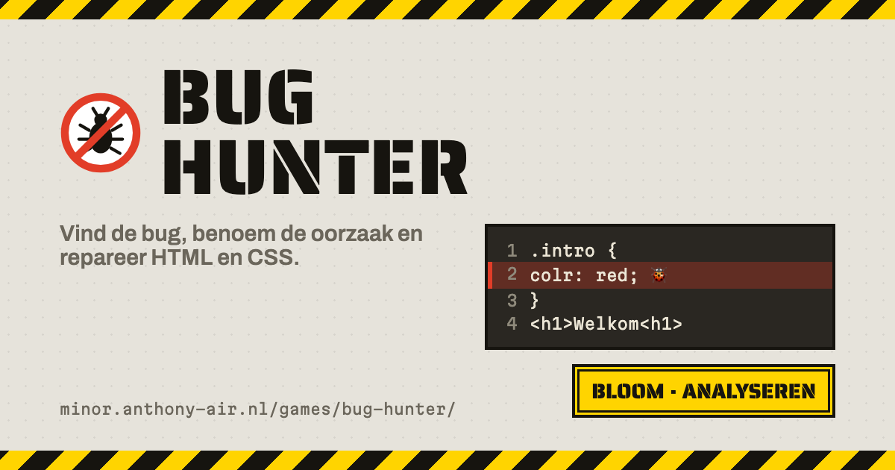
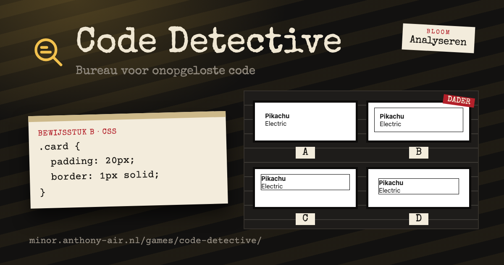

<div align="center">

# Minor: AI, Games & Digitale geletterdheid

**Work from my minor, collected on one small site: educational browser games, reports and other pieces.**

[🌐 Live site](https://minor.anthony-air.nl) · [🎮 Game skill tree](https://minor.anthony-air.nl/games/) · [💼 Portfolio](https://anthony-air.nl)


<a href="https://minor.anthony-air.nl/games/"></a>

</div>

## About

A plain HTML/CSS/JavaScript site, no framework or build step, for the work I make during the minor
*AI, Games & Digitale geletterdheid*. Every game is registered in `games/games.json`; the home page
and the skill tree at `/games/` both read it.

## The skill tree

[`/games/`](https://minor.anthony-air.nl/games/) is the heart of the site: eight games on one route, from recognising your
first HTML tag to building a small website on your own. Every game trains one level of Bloom's taxonomy
(remember, understand, apply, analyse, evaluate, create), and passing a game unlocks the next one. After
Build the DOM the route splits: Style Lab and Layout Builder open together, and Bug Hunter waits until
both are passed.

- **Play with a player ID** to save progress: enter a made-up code (no real names), and every passed game is
  stored and unlocks what comes next, with a short unlock animation when you get back to the tree.
- **Free play** opens every game and saves nothing.
- **Passing** means at least 80% on the first try; extra points don't buy your way in.
- Games run in a dialog on the page. Each one is a stand-alone page with its own theme and mechanic, and
  talks to the tree only through `GAME_COMPLETED` and `GAME_EXIT` messages.

Six of the eight games are playable now; Code Review and Website Challenge are still being built.

### Games

All games are in Dutch.

<table>
<tr>
<td width="46%"><a href="https://minor.anthony-air.nl/games/html-hunter/"></a></td>
<td><b><a href="https://minor.anthony-air.nl/games/html-hunter/">HTML Hunter</a></b> · <i>Remember</i><br><br>A naturalist's field guide to HTML. Learn to recognise the building blocks of the web before you start building: matching, recognising and the reverse direction, from remembering which element is which to understanding what each one does.</td>
</tr>
<tr>
<td width="46%"><a href="https://minor.anthony-air.nl/games/build-the-dom/"></a></td>
<td><b><a href="https://minor.anthony-air.nl/games/build-the-dom/">Build the DOM</a></b> · <i>Understand</i><br><br>A dark code editor with a live DOM tree. Learn how HTML elements fit together into one page: build the main structure, place visible content and explain why a structure is wrong.</td>
</tr>
<tr>
<td width="46%"><a href="https://minor.anthony-air.nl/games/style-lab/"></a></td>
<td><b><a href="https://minor.anthony-air.nl/games/style-lab/">Style Lab</a></b> · <i>Apply</i><br><br>A science lab. Every task is an experiment: make your sample match the reference sample, then analyse it. Pour in one property, combine properties and pick the selector, then write the CSS yourself with a lab assistant that flags typos. Covers selectors, <code>color</code>, <code>background</code>, <code>font-size</code>, <code>font-weight</code>, <code>border</code>, <code>border-radius</code>, <code>padding</code> and <code>margin</code>.</td>
</tr>
<tr>
<td width="46%"><a href="https://minor.anthony-air.nl/games/layout-builder/"></a></td>
<td><b><a href="https://minor.anthony-air.nl/games/layout-builder/">Layout Builder</a></b> · <i>Apply</i><br><br>An architect's blueprint. The target layout lies as dashed lines over your page; pick an element and set its CSS until every block fits the lines, then have it inspected. Side by side or stacked, spacing and alignment, and a card layout across several elements with <code>display</code>, <code>flex-direction</code>, <code>justify-content</code>, <code>align-items</code>, <code>gap</code>, <code>width</code>, <code>padding</code> and <code>margin</code>.</td>
</tr>
<tr>
<td width="46%"><a href="https://minor.anthony-air.nl/games/bug-hunter/"></a></td>
<td><b><a href="https://minor.anthony-air.nl/games/bug-hunter/">Bug Hunter</a></b> · <i>Analyse</i><br><br>A pest-control crew for websites. Each job has a client's complaint, the desired and the broken site, and the code: locate the bug's line, pick its cause from identification cards, then repair it. Points go to the right line and the right cause, so analysis beats trial and error. One bug per job, two bugs per job, then bugs that sit between the HTML and the CSS.</td>
</tr>
<tr>
<td width="46%"><a href="https://minor.anthony-air.nl/games/code-detective/"></a></td>
<td><b><a href="https://minor.anthony-air.nl/games/code-detective/">Code Detective</a></b> · <i>Analyse</i><br><br>A film-noir detective office. You only get the code, typed on a case file, and predict what the browser makes of it before you see it: point out the right preview in a police lineup, mark every element a selector hits, and reconstruct what changes when a line is edited (including a specificity trap where nothing changes).</td>
</tr>
</table>

## Adding a game

1. Put the game in `games/<name>/` with an `index.html`. When the player passes, the game sends one
   message to the page around it:
   `window.parent.postMessage({ type: "GAME_COMPLETED", gameId, score, maxScore }, location.origin)`.
2. Add it to `games/games.json` (`schemaVersion` 1, same format as the course's basisskilltree):

   ```json
   {
     "id": "build-the-dom",
     "title": "Build the DOM",
     "learningGoal": "Ontdek hoe HTML-elementen samen de structuur van een webpagina vormen.",
     "path": "/games/build-the-dom/",
     "requires": [{ "gameId": "html-hunter", "type": "completed" }]
   }
   ```

   - `id` is exactly the `gameId` the game sends; never rename it.
   - `requires`: `[]` opens it at once; `{"gameId": "…", "type": "completed"}` needs that game passed;
     `{"gameId": "…", "type": "minPercent", "value": 80}` needs at least that percentage. All conditions must hold.
   - Unknown fields, unknown ids, a game that requires itself or a circle are reported on `/games/`
     and that entry is left out.
3. Give it a place on the route in the `GAMES` list in `games/index.html` (Bloom level, key question, position),
   and an emblem in `games/emblems/<id>.svg`.
4. Give it a share preview: a 1200×630 image in `og/<id>.png` in the game's own style, plus the favicon links and
   the `og:` and `twitter:` tags in the head of its `index.html` (copy them from another game). The Dockerfile
   copies `og/` into the image.

Players save progress under a made-up player code on `/games/`: the page opens the game in a dialog,
receives `GAME_COMPLETED` and stores `{pseudonym, gameId, score, maxScore}` through `api.php`, then reads
the progress back. Free play opens every game and saves nothing.

## Running it

Open `index.html` through any static file server, for example:

```bash
npx serve .
```

In production the site runs as an `nginx:alpine` container (see `Dockerfile` and `compose.yml`)
behind a reverse proxy.

---

<div align="center">

Made by **Anthony Inocencio Ramos** · [anthony-air.nl](https://anthony-air.nl) · [LinkedIn](https://www.linkedin.com/in/anthony-inoc%C3%AAncio-ramos-b89003277/)

</div>
