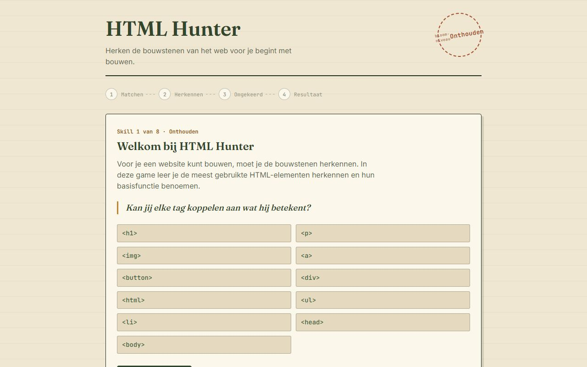

<div align="center">

# Minor: AI, Games & Digitale geletterdheid

**Work from my minor, collected on one small site: educational browser games, reports and other pieces.**

[🌐 Live site](https://minor.anthony-air.nl) · [🎮 HTML Hunter](https://minor.anthony-air.nl/games/html-hunter/index.html) · [💼 Portfolio](https://anthony-air.nl)


<a href="https://minor.anthony-air.nl/games/html-hunter/index.html"></a>

</div>

## About

A plain HTML/CSS/JavaScript site, no framework or build step, for the work I make during the minor
*AI, Games & Digitale geletterdheid*. The home page lists everything in `manifest.json` and groups
it into games and PDFs.

### Games

- **HTML Hunter** (Dutch): learn to recognise the building blocks of the web before you start
  building. Four stages (matching, recognising, the reverse direction and a result screen) move from
  remembering which HTML element is which to understanding what each one does.

## Adding something

1. Put the file in `games/<name>/` or `pdfs/`.
2. Add an entry to `manifest.json`:

   ```json
   {
     "title": "HTML Hunter",
     "description": "Herken de bouwstenen van het web voor je begint met bouwen.",
     "type": "game",
     "path": "games/html-hunter/index.html"
   }
   ```

   `type` is `game` or `pdf`; it decides the section the item appears in.

## Running it

Open `index.html` through any static file server, for example:

```bash
npx serve .
```

In production the site runs as an `nginx:alpine` container (see `Dockerfile` and `compose.yml`)
behind a reverse proxy.

---

<div align="center">

Made by **Anthony Inocencio Ramos** · [anthony-air.nl](https://anthony-air.nl) · [LinkedIn](https://www.linkedin.com/in/anthony-inoc%C3%AAncio-ramos-b89003277/)

</div>
